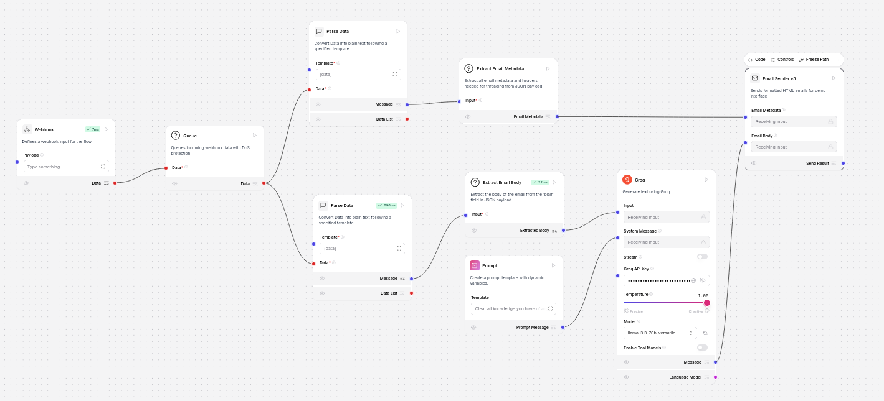

# Email as an AI Endpoint (EaaE)
Preprint conference paper describing the use of email as a standard AI endpoint

## Press Coverage
- [Yahoo Finance](https://finance.yahoo.com/news/existing-business-email-now-acts-132600185.html)
- [Seeking Alpha](https://seekingalpha.com/pr/20003859-existing-business-email-now-acts-as-enterprise-ai-gateway-with-new-technique)
- [Morningstar](https://www.morningstar.com/news/pr-newswire/20250217ph20623/existing-business-email-now-acts-as-enterprise-ai-gateway-with-new-technique)

Read the full paper on GitHub [email_as_ai_endpoint.pdf](./email_as_ai_endpoint.pdf)

## Highlights:
- We present a method to use email to chat and interact with AI, broadly
- We outline a three-layer architecture: email interface, webhook service, and AI orchestration
- The implementation can run fully local; enabling businesses to deploy in-house AI interactions through existing email systems
- We describe the benefits of email’s inherent characteristics of broad accessibility and asynchronous processing
- We provide a public demonstration; accessible by sending email to interface@integralbi.ai

## Benefits:
- Users do not need to adapt to new interfaces or frequently switch between their inbox and AI chat
- Works across all email platforms and all AI model providers; local and API
- Asynchronous nature alleviates the burden of minimizing latency/time-to-first-token
- Asynchronous nature allows certain processing workloads (EG: detailed multi-agent report analysis, etc.) to be assigned a deadline to facilitate management of inference workloads
- And many others

## Architecture

## Orchestration Layer

## Implementation

# Demo
We provide a public demonstration; accessible by sending email to interface@integralbi.ai
